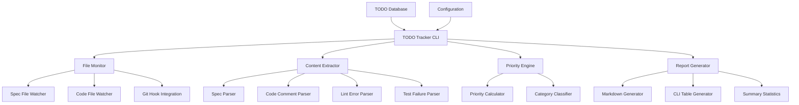

# Design Document

## Overview

The General TODO Tracker is a vendor-agnostic, continuously updated system that monitors all project files, extracts actionable items from multiple sources, and maintains a centralized TODO list. The system operates as both a CLI tool and an automated background process that integrates with any development workflow, regardless of the AI assistant, issue tracker, or development tools being used. It provides real-time visibility into all pending work across the project without requiring specific vendor integrations.

## Architecture

### Core Components



### Data Flow

1. **Continuous Monitoring**: File watchers detect changes in spec files, source code, and project configuration
2. **Content Extraction**: Parsers extract TODO items from various sources (specs, comments, lint errors, test failures)
3. **Processing**: Priority engine categorizes and prioritizes items based on configurable rules
4. **Storage**: Items are stored in a structured format with metadata and cross-references
5. **Reporting**: Generate various output formats for different consumption patterns

## Components and Interfaces

### TODOTracker (Main Class)
```javascript
class TODOTracker {
  constructor(config)
  async initialize()
  async scan()
  async update()
  async generateReport(format)
  async addManualItem(item)
  async completeItem(id)
}
```

### FileMonitor
```javascript
class FileMonitor {
  constructor(patterns, callback)
  start()
  stop()
  addPattern(pattern)
  removePattern(pattern)
}
```

### ContentExtractor
```javascript
class ContentExtractor {
  async extractFromSpecs(specFiles)
  async extractFromCode(sourceFiles)
  async extractFromLintResults(lintOutput)
  async extractFromTestResults(testOutput)
  parseComments(content)
  parseSpecTasks(content)
}
```

### PriorityEngine
```javascript
class PriorityEngine {
  calculatePriority(item)
  categorizeItem(item)
  assignEffortEstimate(item)
  detectDependencies(items)
}
```

### ReportGenerator
```javascript
class ReportGenerator {
  generateMarkdown(items, options)
  generateTable(items, options)
  generateSummary(items)
  generateTrends(items, history)
}
```

## Data Models

### TODOItem
```javascript
{
  id: string,
  title: string,
  description: string,
  source: 'spec' | 'code' | 'lint' | 'test' | 'manual',
  sourceFile: string,
  lineNumber: number,
  category: 'bug' | 'enhancement' | 'refactor' | 'documentation' | 'test',
  priority: 'critical' | 'high' | 'medium' | 'low',
  effort: 'xs' | 's' | 'm' | 'l' | 'xl',
  status: 'open' | 'in-progress' | 'completed',
  assignee: string,
  dueDate: Date,
  tags: string[],
  dependencies: string[],
  specReference: string,
  createdAt: Date,
  updatedAt: Date,
  completedAt: Date,
  metadata: object
}
```

### Configuration
```javascript
{
  watchPatterns: string[],
  excludePatterns: string[],
  priorityRules: object,
  categoryRules: object,
  outputFormats: string[],
  updateInterval: number,
  integrations: {
    versionControl: 'auto' | 'git' | 'svn' | 'hg' | 'none',
    linting: 'auto' | 'eslint' | 'pylint' | 'rubocop' | 'none',
    testing: 'auto' | 'jest' | 'pytest' | 'go-test' | 'none',
    issueTracking: 'none' | 'github' | 'gitlab' | 'jira' | 'linear'
  },
  customParsers: object[],
  aiAgnosticOutput: boolean, // Generate standard formats readable by any AI
  standardFormats: ['markdown', 'json', 'csv', 'plain-text']
}
```

## Error Handling

### File System Errors
- Handle missing files gracefully with warning logs
- Retry file operations with exponential backoff
- Provide fallback behavior when file watching fails

### Parser Errors
- Continue processing other files when individual parsers fail
- Log parsing errors with context for debugging
- Provide partial results when some extractors fail

### Integration Errors
- Handle missing lint/test tools gracefully
- Provide meaningful error messages for configuration issues
- Fallback to basic functionality when integrations fail

## Testing Strategy

### Unit Tests
- Test each content extractor independently with sample files
- Test priority calculation with various item types
- Test report generation with different output formats
- Mock file system operations for reliable testing

### Integration Tests
- Test end-to-end workflow with real project files
- Test file watching with actual file modifications
- Test CLI integration with various command combinations
- Test cross-spec dependency detection

### Performance Tests
- Benchmark file scanning performance with large codebases
- Test memory usage with continuous monitoring
- Test update performance with frequent file changes
- Validate startup time with various project sizes

### Compatibility Tests
- Test with different spec file formats and structures
- Test with various linting tools and configurations
- Test with different test frameworks and output formats
- Validate cross-platform file watching behavior