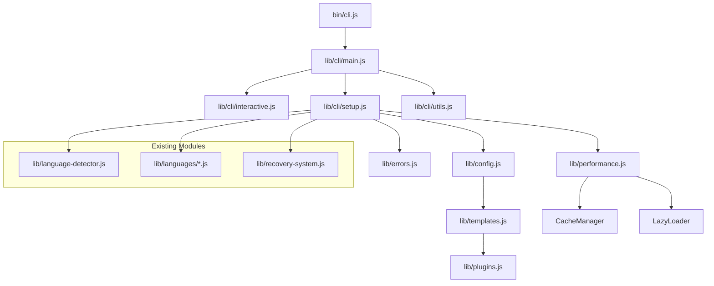
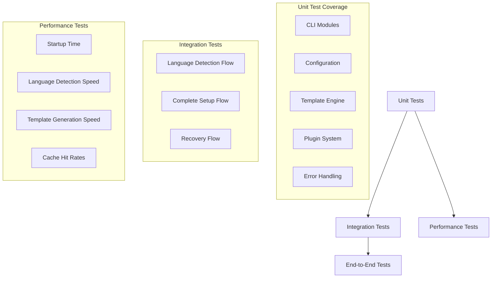

# Design Document

## Overview

This design document outlines the systematic enhancement of the claude-setup tool through a three-phase architectural transformation. The current monolithic CLI structure (200+ lines in bin/cli.js) will be refactored into a modular, maintainable, and extensible system. The design emphasizes backward compatibility, performance optimization, and developer experience improvements while maintaining the tool's core functionality.

## Architecture

### Current State Analysis

The existing architecture has several areas for improvement:
- **Monolithic CLI**: bin/cli.js contains 200+ lines mixing argument parsing, user interaction, and setup orchestration
- **Limited Error Handling**: Basic console.log error reporting without actionable guidance
- **No Configuration System**: Hard-coded defaults with no team standardization support
- **Performance Issues**: No caching, lazy loading, or optimization for repeated operations
- **Testing Gaps**: Limited test coverage for core lib/ modules

### Target Architecture

The new architecture follows a layered, modular design:



### Design Principles

1. **Single Responsibility**: Each module has one clear purpose
2. **Backward Compatibility**: Existing CLI interface remains unchanged
3. **Progressive Enhancement**: New features are opt-in and non-breaking
4. **Performance First**: Lazy loading and caching by default
5. **Extensibility**: Plugin architecture for custom functionality

## Components and Interfaces

### Phase 1: Foundation Components

#### CLI Module Structure

```javascript
// lib/cli/main.js - Entry point and argument parsing
export class CLIMain {
  async parseArgs(argv) {
    // Parse command line arguments
    // Handle --fix, --dry-run, --sync-issues flags
    // Return structured configuration object
  }
  
  async runCLI(args) {
    // Main orchestration logic
    // Route to appropriate mode (setup/recovery/devcontainer)
    // Handle global error catching
  }
}

// lib/cli/interactive.js - User interaction
export class InteractiveSetup {
  async buildSmartQuestions(detectedLanguages) {
    // Generate context-aware questions
    // Skip questions with confident auto-detection
    // Provide smart defaults based on project analysis
  }
  
  async runInteractiveSetup(config) {
    // Handle user prompts and responses
    // Validate user input
    // Build final configuration object
  }
}

// lib/cli/setup.js - Setup orchestration
export class SetupOrchestrator {
  async runSetupMode(config) {
    // Coordinate language-specific setup
    // Handle template generation
    // Manage file creation and updates
  }
  
  async runRecoveryMode(options) {
    // Delegate to existing recovery system
    // Add enhanced error reporting
  }
  
  async runDevContainerMode(config) {
    // Generate DevContainer configuration only
    // Support language-specific containers
  }
}

// lib/cli/utils.js - Shared utilities
export class CLIUtils {
  static formatOutput(message, type = 'info') {
    // Consistent message formatting
    // Color coding and icons
  }
  
  static validateProjectStructure(projectPath) {
    // Basic project validation
    // Git repository checks
  }
}
```

#### Error Handling System

```javascript
// lib/errors.js - Centralized error handling
export class SetupError extends Error {
  constructor(message, code, suggestions = [], context = {}) {
    super(message);
    this.name = 'SetupError';
    this.code = code;
    this.suggestions = suggestions;
    this.context = context;
  }
}

export const ERROR_CODES = {
  // Language Detection Errors
  LANGUAGE_DETECTION_FAILED: 'LANG_001',
  MULTIPLE_LANGUAGES_DETECTED: 'LANG_002',
  UNSUPPORTED_LANGUAGE: 'LANG_003',
  
  // File System Errors
  FILE_PERMISSION_DENIED: 'FILE_001',
  FILE_NOT_FOUND: 'FILE_002',
  DIRECTORY_NOT_WRITABLE: 'FILE_003',
  
  // Git Errors
  GIT_NOT_INITIALIZED: 'GIT_001',
  GIT_DIRTY_WORKING_TREE: 'GIT_002',
  
  // Configuration Errors
  CONFIG_INVALID_SCHEMA: 'CONFIG_001',
  CONFIG_MIGRATION_FAILED: 'CONFIG_002'
};

export class ErrorHandler {
  static handle(error, context = {}) {
    // Categorize error type
    // Generate actionable suggestions
    // Format user-friendly output
    // Log technical details for debugging
  }
  
  static suggest(errorCode, context) {
    // Return specific suggestions based on error code
    // Include commands to run, files to check, etc.
  }
}
```

### Phase 2: User Experience Components

#### Configuration System

```javascript
// lib/config.js - Configuration management
export class ConfigManager {
  constructor(projectPath = process.cwd()) {
    this.projectPath = projectPath;
    this.userConfigPath = path.join(os.homedir(), '.claude-setup.json');
    this.projectConfigPath = path.join(projectPath, '.claude-setup.json');
  }
  
  async loadConfig() {
    // Load and merge configurations: defaults → user → project
    // Handle configuration inheritance
    // Validate merged configuration
  }
  
  async saveConfig(config, scope = 'project') {
    // Save configuration to appropriate location
    // Validate before saving
    // Create backup of existing config
  }
  
  async validateConfig(config) {
    // JSON schema validation
    // Check for deprecated options
    // Verify file paths and dependencies
  }
  
  async migrateConfig(oldConfig) {
    // Handle configuration format changes
    // Preserve user customizations
    // Log migration actions
  }
}

// Configuration Schema
const CONFIG_SCHEMA = {
  version: '1.0',
  defaults: {
    qualityLevel: 'standard', // 'minimal', 'standard', 'strict'
    teamSize: 'small',        // 'solo', 'small', 'large'
    ciProvider: 'github',     // 'github', 'gitlab', 'none'
    testFramework: 'auto'     // 'auto', 'jest', 'vitest', etc.
  },
  overrides: {
    // Language-specific overrides
    javascript: { qualityLevel: 'strict' },
    python: { testFramework: 'pytest' }
  },
  templates: {
    customCommands: [],       // Additional command directories
    customTemplates: []       // Custom template paths
  },
  plugins: {
    enabled: [],              // Plugin names to load
    disabled: [],             // Plugins to explicitly disable
    autoApprove: []           // Plugins that don't need confirmation
  }
};
```

#### Performance Optimization

```javascript
// lib/performance.js - Performance utilities
export class LazyLoader {
  constructor() {
    this.cache = new Map();
  }
  
  async loadModule(moduleName) {
    // Load modules on-demand
    // Cache loaded modules
    // Handle loading errors gracefully
  }
  
  getCachedModule(moduleName) {
    // Return cached module if available
    // Track cache hit/miss rates
  }
}

export class CacheManager {
  constructor(cacheDir = '.claude-setup-cache') {
    this.cacheDir = path.join(os.homedir(), cacheDir);
  }
  
  async get(key, ttl = 3600000) { // 1 hour default
    // Retrieve cached value if not expired
    // Handle cache corruption gracefully
  }
  
  async set(key, value, ttl) {
    // Store value with expiration
    // Implement cache size limits
    // Clean up expired entries
  }
  
  async invalidate(pattern) {
    // Remove cache entries matching pattern
    // Support glob patterns for bulk invalidation
  }
}

export class PerformanceMonitor {
  static startTimer(operation) {
    // Track operation timing
    // Support nested operations
  }
  
  static endTimer(operation) {
    // Calculate and log timing
    // Identify performance bottlenecks
  }
  
  static getMetrics() {
    // Return performance statistics
    // Support performance regression detection
  }
}
```

### Phase 3: Advanced Components

#### Template System Enhancement

```javascript
// lib/templates.js - Enhanced template engine
export class TemplateEngine {
  constructor(templateDir = 'templates') {
    this.templateDir = templateDir;
    this.cache = new Map();
  }
  
  async render(templatePath, variables) {
    // Render template with variable substitution
    // Support conditional blocks and loops
    // Handle template inheritance
  }
  
  async parseConditionals(template) {
    // Parse {{#if condition}} blocks
    // Support complex boolean expressions
    // Nested conditional support
  }
  
  async resolveInheritance(template) {
    // Handle {{#include base-template.md}}
    // Recursive template resolution
    // Circular dependency detection
  }
  
  validateTemplate(template) {
    // Check template syntax
    // Verify variable references
    // Detect unused variables
  }
}

// Template Syntax Examples
const TEMPLATE_SYNTAX = {
  variables: '{{variableName}}',
  conditionals: '{{#if condition}}content{{/if}}',
  loops: '{{#each items}}{{name}}{{/each}}',
  inheritance: '{{#include base-template.md}}',
  comments: '{{!-- This is a comment --}}'
};
```

#### Plugin Architecture

```javascript
// lib/plugins.js - Plugin management system
export class PluginManager {
  constructor(pluginDir = 'plugins') {
    this.pluginDir = pluginDir;
    this.loadedPlugins = new Map();
    this.sandbox = new PluginSandbox();
  }
  
  async loadPlugin(pluginPath) {
    // Load and validate plugin
    // Check plugin interface compliance
    // Initialize plugin in sandbox
  }
  
  async validatePlugin(plugin) {
    // Verify plugin interface
    // Check security constraints
    // Validate plugin metadata
  }
  
  async executePlugin(plugin, config) {
    // Execute plugin in sandboxed environment
    // Handle plugin errors gracefully
    // Track plugin performance
  }
  
  async discoverPlugins() {
    // Scan for available plugins
    // Support npm packages and local files
    // Cache plugin discovery results
  }
}

// Plugin Interface
export interface Plugin {
  name: string;
  version: string;
  description: string;
  author: string;
  
  // Required methods
  setup(config: SetupConfig): Promise<void>;
  
  // Optional methods
  validate?(config: SetupConfig): ValidationResult;
  cleanup?(): Promise<void>;
  getCommands?(): PluginCommand[];
}

export class PluginSandbox {
  // Secure execution environment for plugins
  // Limited file system access
  // No network access by default
  // Resource usage limits
}
```

## Data Models

### Configuration Model

```javascript
export class SetupConfig {
  constructor(data = {}) {
    this.version = data.version || '1.0';
    this.projectType = data.projectType;
    this.qualityLevel = data.qualityLevel || 'standard';
    this.teamSize = data.teamSize || 'small';
    this.features = data.features || {};
    this.overrides = data.overrides || {};
    this.plugins = data.plugins || {};
  }
  
  validate() {
    // Validate configuration against schema
    // Return validation errors if any
  }
  
  merge(otherConfig) {
    // Deep merge configurations
    // Handle array and object merging
  }
  
  toJSON() {
    // Serialize for storage
    // Exclude runtime-only properties
  }
}
```

### Language Detection Model

```javascript
export class LanguageDetectionResult {
  constructor(language, confidence, evidence = []) {
    this.language = language;
    this.confidence = confidence; // 'high', 'medium', 'low'
    this.evidence = evidence;     // Files/patterns that led to detection
    this.timestamp = new Date();
  }
  
  isConfident() {
    return this.confidence === 'high';
  }
  
  getEvidenceString() {
    return this.evidence.join(', ');
  }
}
```

### Error Model

```javascript
export class ErrorContext {
  constructor(operation, projectPath, config = {}) {
    this.operation = operation;
    this.projectPath = projectPath;
    this.config = config;
    this.timestamp = new Date();
    this.environment = {
      nodeVersion: process.version,
      platform: process.platform,
      cwd: process.cwd()
    };
  }
  
  addDetail(key, value) {
    this.details = this.details || {};
    this.details[key] = value;
  }
}
```

## Error Handling

### Error Categories and Recovery

```javascript
export const ERROR_RECOVERY_STRATEGIES = {
  [ERROR_CODES.LANGUAGE_DETECTION_FAILED]: {
    suggestions: [
      'Run with --language flag to specify manually',
      'Check if project contains recognizable files (package.json, requirements.txt, etc.)',
      'Use --recovery mode to analyze existing setup'
    ],
    autoRecovery: async (context) => {
      // Attempt to detect based on file extensions
      // Suggest most likely language based on directory structure
    }
  },
  
  [ERROR_CODES.FILE_PERMISSION_DENIED]: {
    suggestions: [
      'Check file permissions with: ls -la',
      'Run with appropriate permissions: sudo claude-setup',
      'Ensure you own the project directory'
    ],
    autoRecovery: async (context) => {
      // Check if running with sufficient permissions
      // Suggest specific chmod commands
    }
  },
  
  [ERROR_CODES.GIT_NOT_INITIALIZED]: {
    suggestions: [
      'Initialize git repository: git init',
      'Clone from existing repository',
      'Use --no-git flag to skip git integration'
    ],
    autoRecovery: async (context) => {
      // Offer to initialize git repository
      // Check for remote repository indicators
    }
  }
};
```

### Progress Reporting

```javascript
export class ProgressReporter {
  constructor(total, description = 'Processing') {
    this.total = total;
    this.current = 0;
    this.description = description;
    this.startTime = Date.now();
  }
  
  update(increment = 1, message = '') {
    // Update progress and display
    // Show estimated time remaining
    // Handle console width for proper formatting
  }
  
  complete(message = 'Complete') {
    // Show completion message
    // Display total time taken
    // Clean up progress display
  }
}
```

## Testing Strategy

### Test Architecture



### Test Implementation Strategy

```javascript
// __tests__/lib/cli/main.test.js
describe('CLIMain', () => {
  test('parseArgs handles all flag combinations', async () => {
    // Test argument parsing edge cases
    // Verify flag precedence and conflicts
  });
  
  test('runCLI routes to correct mode', async () => {
    // Test mode routing logic
    // Verify error handling for invalid modes
  });
  
  test('performance: startup time under 2 seconds', async () => {
    // Benchmark startup performance
    // Fail if performance regression detected
  });
});

// __tests__/integration/setup-flow.test.js
describe('Complete Setup Flow', () => {
  test('JavaScript project setup end-to-end', async () => {
    // Create temporary project
    // Run complete setup process
    // Verify all expected files created
    // Validate generated content
  });
  
  test('handles existing files gracefully', async () => {
    // Test setup with pre-existing configuration
    // Verify backup and merge behavior
  });
});

// __tests__/performance/benchmarks.test.js
describe('Performance Benchmarks', () => {
  test('language detection completes in <100ms', async () => {
    // Benchmark language detection speed
    // Test with various project sizes
  });
  
  test('cache improves repeat performance by 50%', async () => {
    // Measure first run vs cached run
    // Verify cache effectiveness
  });
});
```

### Testing Utilities

```javascript
// __tests__/utils/test-helpers.js
export class TestProjectBuilder {
  constructor(tempDir) {
    this.tempDir = tempDir;
    this.files = new Map();
  }
  
  addFile(path, content) {
    // Add file to test project
    // Support template content
  }
  
  addPackageJson(dependencies = {}) {
    // Add package.json with specified dependencies
    // Include common test configurations
  }
  
  async build() {
    // Create all files in temporary directory
    // Return project path for testing
  }
  
  async cleanup() {
    // Remove temporary project files
    // Clean up any created resources
  }
}

export class MockFileSystem {
  // Mock fs operations for isolated testing
  // Track file system interactions
  // Support error injection for testing error handling
}
```

## Implementation Phases

### Phase 1: Foundation (Weeks 1-2)
- **Week 1**: CLI architecture refactor and error handling
- **Week 2**: Enhanced testing infrastructure and performance monitoring

### Phase 2: User Experience (Weeks 3-4)  
- **Week 3**: Configuration system and documentation optimization
- **Week 4**: Performance optimization and caching implementation

### Phase 3: Advanced Features (Weeks 5-6)
- **Week 5**: Extended language support and template system enhancement
- **Week 6**: Plugin architecture and final integration testing

### Migration Strategy

1. **Backward Compatibility**: Maintain existing CLI interface throughout
2. **Feature Flags**: New features behind configuration flags initially
3. **Gradual Migration**: Move functionality module by module
4. **User Communication**: Clear documentation of changes and benefits
5. **Rollback Plan**: Git tags for stable versions at each phase

### Risk Mitigation

- **Breaking Changes**: Extensive testing with real projects before release
- **Performance Regression**: Continuous benchmarking and performance tests
- **User Adoption**: Opt-in features with clear migration paths
- **Complexity Management**: Regular code reviews and architecture validation