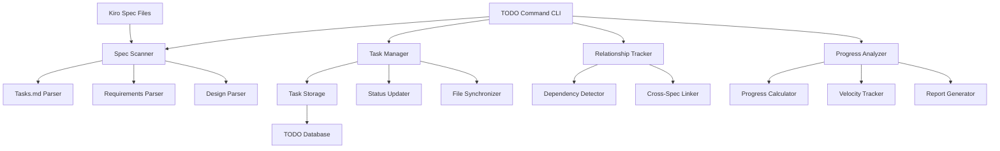

# Design Document

## Overview

The redesigned `/todo` command transforms from a simple task viewer into an intelligent Kiro-spec-aware task management system. It operates as both a CLI command and an underlying service that understands the Kiro specification structure, automatically extracts tasks from spec files, manages task relationships, and provides comprehensive project task visibility. The system bridges the gap between high-level spec planning and day-to-day development work.

## Architecture

### Core Components



### Data Flow

1. **Spec Discovery**: Automatically scan `.kiro/specs/` for all specification directories
2. **Task Extraction**: Parse `tasks.md`, `requirements.md`, and `design.md` files for actionable items
3. **Relationship Mapping**: Identify dependencies between tasks across different specs
4. **Storage & Indexing**: Store tasks with metadata, relationships, and source references
5. **Command Processing**: Handle CLI operations (list, add, complete, status, sync)
6. **File Synchronization**: Update source spec files when task status changes

## Components and Interfaces

### TodoCommand (Main CLI Handler)
```javascript
class TodoCommand {
  async execute(args)
  async list(filters)
  async add(description, options)
  async complete(taskId)
  async status(specName)
  async sync()
  async interactive()
}
```

### SpecScanner
```javascript
class SpecScanner {
  async scanAllSpecs()
  async parseTasksFile(filePath)
  async parseRequirementsFile(filePath)
  async extractDesignTasks(filePath)
  async detectSpecChanges()
}
```

### TaskManager
```javascript
class TaskManager {
  async addTask(task, options)
  async updateTaskStatus(taskId, status)
  async getTask(taskId)
  async searchTasks(criteria)
  async syncToSpecFiles()
  generateTaskId()
}
```

### RelationshipTracker
```javascript
class RelationshipTracker {
  detectDependencies(tasks)
  mapRequirementToTasks(requirement, tasks)
  findCrossSpecRelationships(allTasks)
  buildDependencyGraph(tasks)
  identifyBlockingTasks(tasks)
}
```

### ProgressAnalyzer
```javascript
class ProgressAnalyzer {
  calculateSpecProgress(specName)
  calculateOverallProgress()
  identifyCompletionTrends()
  estimateRemainingEffort()
  generateProgressReport(format)
}
```

## Data Models

### KiroTask
```javascript
{
  id: string,                    // Unique identifier (e.g., "file-org-3.2")
  title: string,                 // Task description
  description: string,           // Full task details
  specName: string,              // Source spec (e.g., "file-organization-cleanup")
  sourceFile: string,            // Path to tasks.md file
  lineNumber: number,            // Line in source file
  status: 'pending' | 'in_progress' | 'completed',
  priority: 'critical' | 'high' | 'medium' | 'low',
  category: 'implementation' | 'testing' | 'documentation' | 'analysis',
  requirements: string[],        // Referenced requirement IDs
  dependencies: string[],        // Dependent task IDs
  estimatedEffort: 'xs' | 's' | 'm' | 'l' | 'xl',
  assignee: string,
  createdAt: Date,
  updatedAt: Date,
  completedAt: Date,
  notes: string[],              // Additional notes with timestamps
  metadata: {
    requirementRefs: string[],   // _Requirements: 1.1, 2.3_
    crossSpecDeps: string[],     // Dependencies on other specs
    designContext: string        // Related design decisions
  }
}
```

### SpecMetadata
```javascript
{
  name: string,                  // Spec directory name
  title: string,                 // Extracted from requirements.md
  tasksFile: string,             // Path to tasks.md
  requirementsFile: string,      // Path to requirements.md
  designFile: string,            // Path to design.md
  totalTasks: number,
  completedTasks: number,
  progress: number,              // 0-100 percentage
  lastUpdated: Date,
  dependencies: string[],        // Other specs this depends on
  dependents: string[]           // Other specs that depend on this
}
```

### TodoConfig
```javascript
{
  specDirectory: '.kiro/specs',
  taskIdFormat: '{spec-name}-{task-number}',
  defaultPriority: 'medium',
  displayFormats: ['table', 'list', 'json', 'markdown'],
  syncOnUpdate: boolean,
  trackVelocity: boolean,
  estimationEnabled: boolean,
  crossSpecAnalysis: boolean,
  interactiveMode: boolean
}
```

## Command Interface Design

### Primary Commands
- `/todo` - Interactive task browser
- `/todo list [spec] [status]` - List tasks with optional filtering
- `/todo add <description> [--spec <name>] [--priority <level>]` - Add new task
- `/todo complete <task-id>` - Mark task complete
- `/todo status [spec]` - Show progress for spec or overall
- `/todo sync` - Refresh tasks from spec files

### Interactive Browser Features
- Arrow key navigation through task list
- Filter by spec, status, priority
- Quick complete/uncomplete toggle
- Jump to source file in editor
- Show task dependencies and relationships

### Display Formats
```
# Table Format
┌─────────────┬──────────────────────────────────┬────────────┬──────────┬──────────┐
│ ID          │ Description                      │ Spec       │ Status   │ Priority │
├─────────────┼──────────────────────────────────┼────────────┼──────────┼──────────┤
│ file-org-3  │ Build spec file content extractor│ file-org   │ pending  │ high     │
│ todo-cmd-1  │ Create core TODO tracker infra   │ todo-cmd   │ progress │ critical │
└─────────────┴──────────────────────────────────┴────────────┴──────────┴──────────┘

# Progress Summary
📊 Overall Progress: 23/67 tasks complete (34%)
   file-organization-cleanup: 8/14 tasks (57%)
   todo-command-redesign: 0/12 tasks (0%)
   test-antipattern-fixes: 15/41 tasks (37%)
```

## File Synchronization Strategy

### Bidirectional Sync
- Tasks created via CLI → Added to appropriate spec tasks.md files
- Spec file changes → Automatically detected and updated in task database
- Status changes → Written back to source files maintaining format

### Format Preservation
```markdown
# Original Format (preserved)
- [ ] 3. Build spec file content extractor
  - Create lib/extractors/spec-extractor.js for parsing spec files
  - Implement task extraction from tasks.md files with status tracking
  - _Requirements: 3.1, 3.2, 3.3, 3.4_

# After CLI completion
- [x] 3. Build spec file content extractor
  - Create lib/extractors/spec-extractor.js for parsing spec files
  - Implement task extraction from tasks.md files with status tracking
  - _Requirements: 3.1, 3.2, 3.3, 3.4_
  - _Completed: 2025-07-21 via /todo complete file-org-3_
```

## Error Handling

### Spec File Errors
- Handle missing or malformed spec files gracefully
- Provide helpful error messages for parsing failures
- Continue operation when individual specs fail to parse
- Offer repair suggestions for common formatting issues

### Synchronization Errors
- Detect and resolve conflicts between CLI changes and file changes
- Provide merge strategies for concurrent modifications
- Backup original files before making changes
- Rollback capability for failed synchronization

### Command Errors
- Validate task IDs before operations
- Clear error messages for invalid filters or arguments
- Suggest corrections for typos in spec names or task IDs
- Help text for all command variations

## Performance Considerations

### Caching Strategy
- Cache parsed spec data with file modification time checks
- Incremental updates when only specific files change
- In-memory task index for fast filtering and searching
- Lazy loading of large spec collections

### File Watching
- Optional file system watching for real-time updates
- Debounced change detection to avoid excessive parsing
- Selective watching of only tracked spec directories
- Graceful degradation when file watching unavailable

## Testing Strategy

### Unit Tests
- Test spec file parsing with various formats and edge cases
- Test task relationship detection with complex dependency chains
- Test CLI command parsing and validation
- Mock file system operations for reliable testing

### Integration Tests
- Test end-to-end workflow from spec creation to task completion
- Test bidirectional synchronization with real spec files
- Test interactive mode with simulated user input
- Validate cross-spec dependency tracking accuracy

### Performance Tests
- Benchmark parsing performance with large numbers of specs
- Test memory usage with extensive task collections
- Validate file watching performance with frequent changes
- Measure CLI response times for various operations