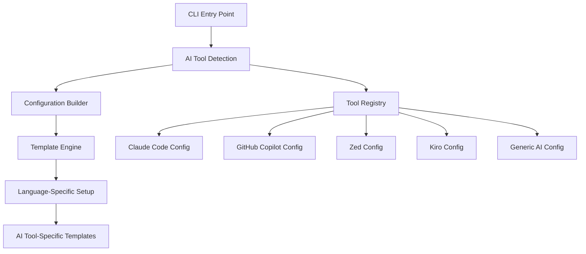

# Design Document

## Overview

This design transforms the claude-setup tool from being Claude Code-specific to being tool-agnostic while maintaining full backward compatibility. The transformation involves creating a flexible AI tool detection and configuration system, updating templates to be tool-neutral, and providing specialized configurations for different AI development environments.

The core principle is to maintain the existing professional development infrastructure while making it accessible to users of any AI development tool, including Claude Code, GitHub Copilot, Zed, Kiro, Cursor, and others.

## Architecture

### Current Architecture Analysis

The current system has three main components:
1. **CLI Layer** - Interactive prompts and argument parsing
2. **Setup Orchestrator** - Coordinates different setup modes and language detection
3. **Template System** - Variable substitution using `{{VARIABLE}}` syntax

The Claude-specific elements are primarily in:
- Branding and naming throughout the codebase
- Template content (CLAUDE.md, ACTIVE_WORK.md)
- CLI help text and console output
- Package naming and descriptions

### New Architecture



## Components and Interfaces

### 1. AI Tool Detection System

**Purpose**: Detect and configure AI development tools in the user's environment.

**Interface**:
```javascript
class AIToolDetector {
  async detectTools()           // Returns array of detected AI tools
  async getBestGuess()          // Returns primary AI tool recommendation
  getToolConfig(toolName)       // Returns configuration for specific tool
  getSupportedTools()           // Returns list of all supported tools
}
```

**Detection Logic**:
- **Claude Code**: Check for `.claude/` directory, `CLAUDE.md` files
- **GitHub Copilot**: Check VS Code settings, Copilot extensions
- **Zed**: Check for Zed configuration files, AI settings
- **Kiro**: Check for `.kiro/` directory, Kiro-specific files
- **Cursor**: Check for Cursor-specific configuration
- **Generic**: Fallback when no specific tool is detected

### 2. Tool Configuration Registry

**Purpose**: Centralized registry of AI tool configurations and capabilities.

**Structure**:
```javascript
const toolRegistry = {
  'claude-code': {
    name: 'Claude Code',
    templates: ['CLAUDE.md', 'commands/', 'ACTIVE_WORK.md'],
    features: ['custom-commands', 'session-memory', 'quality-tracking'],
    detection: ['claude-directory', 'claude-files'],
    priority: 1
  },
  'github-copilot': {
    name: 'GitHub Copilot',
    templates: ['COPILOT.md', 'vscode-settings.json'],
    features: ['inline-suggestions', 'chat-interface'],
    detection: ['vscode-copilot', 'copilot-settings'],
    priority: 2
  },
  'zed': {
    name: 'Zed',
    templates: ['ZED.md', 'zed-settings.json'],
    features: ['ai-assistant', 'collaborative-editing'],
    detection: ['zed-config', 'zed-ai-settings'],
    priority: 3
  },
  'kiro': {
    name: 'Kiro',
    templates: ['KIRO.md', 'kiro-config.json'],
    features: ['autonomous-mode', 'specs-workflow'],
    detection: ['kiro-directory', 'kiro-files'],
    priority: 4
  }
};
```

### 3. Enhanced Template Engine

**Purpose**: Generate tool-specific templates with conditional logic and inheritance.

**Features**:
- **Variable Substitution**: Existing `{{VARIABLE}}` system
- **Conditional Blocks**: `{{#if AI_TOOL === 'claude-code'}}...{{/if}}`
- **Template Inheritance**: Base templates with tool-specific overrides
- **Multi-tool Support**: Generate multiple tool configurations simultaneously

**Template Structure**:
```
templates/
├── base/                    # Tool-agnostic base templates
│   ├── AI_GUIDELINES.md     # Generic AI collaboration template
│   ├── ACTIVE_WORK.md       # Generic session management
│   └── quality-config/      # Quality tool configurations
├── claude-code/             # Claude Code specific templates
│   ├── CLAUDE.md
│   └── commands/
├── github-copilot/          # Copilot specific templates
│   ├── COPILOT.md
│   └── vscode/
├── zed/                     # Zed specific templates
│   └── ZED.md
├── kiro/                    # Kiro specific templates
│   └── KIRO.md
└── generic/                 # Fallback templates
    └── AI_ASSISTANT.md
```

### 4. Updated CLI Interface

**Purpose**: Provide tool-agnostic user experience while maintaining existing functionality.

**New Questions Flow**:
1. **Mode Selection** (unchanged)
2. **AI Tool Detection/Selection** (new)
3. **Project Type** (unchanged)
4. **Quality Level** (unchanged)
5. **Team Size** (unchanged)
6. **CI/CD** (unchanged)

**AI Tool Selection Logic**:
```javascript
// If single tool detected with high confidence
"Detected Claude Code in your environment. Use it for this project?"

// If multiple tools detected
"Multiple AI tools detected: Claude Code, GitHub Copilot. Which would you like to use?"

// If no tools detected
"Which AI development tool do you use? (Claude Code, GitHub Copilot, Zed, Kiro, Other/None)"
```

### 5. Backward Compatibility Layer

**Purpose**: Ensure existing Claude Code users experience no breaking changes.

**Implementation**:
- Maintain existing CLI commands and flags
- Preserve existing template output for Claude Code users
- Keep existing file structures and naming
- Maintain existing package.json scripts and dependencies

## Data Models

### AI Tool Configuration
```javascript
{
  toolName: 'claude-code',
  displayName: 'Claude Code',
  version: '1.0.0',
  features: ['custom-commands', 'session-memory'],
  templates: {
    guidelines: 'CLAUDE.md',
    activeWork: 'ACTIVE_WORK.md',
    commands: 'commands/'
  },
  settings: {
    qualityIntegration: true,
    sessionTracking: true,
    customCommands: true
  }
}
```

### Project Configuration
```javascript
{
  projectType: 'js',
  qualityLevel: 'standard',
  teamSize: 'small',
  cicd: false,
  aiTool: {
    primary: 'claude-code',
    secondary: ['github-copilot'],
    features: ['custom-commands', 'inline-suggestions']
  },
  templates: {
    generated: ['CLAUDE.md', 'ACTIVE_WORK.md', 'commands/'],
    skipped: ['COPILOT.md']
  }
}
```

## Error Handling

### AI Tool Detection Failures
- **No tools detected**: Offer generic professional setup without AI-specific features
- **Multiple tools with equal confidence**: Present user choice with detected evidence
- **Tool detection errors**: Log warnings but continue with generic setup

### Template Generation Failures
- **Missing tool templates**: Fall back to generic AI templates
- **Template syntax errors**: Validate templates during build, fail fast
- **Variable substitution errors**: Provide clear error messages with context

### Migration Failures
- **Incompatible configurations**: Backup existing files before migration
- **Partial migrations**: Provide rollback mechanism
- **Tool conflicts**: Warn users about potential conflicts, offer resolution options

## Testing Strategy

### Unit Tests
- **AI Tool Detection**: Mock file system states for different tool scenarios
- **Template Engine**: Test variable substitution and conditional logic
- **Configuration Validation**: Test all valid/invalid configuration combinations
- **Backward Compatibility**: Ensure existing Claude Code workflows unchanged

### Integration Tests
- **End-to-End Setup**: Test complete setup flow for each supported AI tool
- **Migration Scenarios**: Test upgrading existing Claude Code projects
- **Multi-tool Scenarios**: Test projects with multiple AI tools configured
- **Error Recovery**: Test graceful handling of various failure scenarios

### Compatibility Tests
- **Existing Projects**: Test tool behavior on existing Claude Code projects
- **Template Output**: Verify generated files match expected formats
- **CLI Behavior**: Ensure all existing CLI flags and commands work identically

### Performance Tests
- **Detection Speed**: AI tool detection should complete under 500ms
- **Template Generation**: Template processing should scale linearly with file count
- **Startup Time**: CLI startup should remain under 2 seconds

## Implementation Phases

### Phase 1: Foundation (Backward Compatible)
1. Create AI tool detection system
2. Implement tool registry
3. Add AI tool selection to interactive flow
4. Maintain existing Claude Code as default behavior

### Phase 2: Template System Enhancement
1. Create tool-specific template directories
2. Implement conditional template logic
3. Add template inheritance system
4. Create templates for GitHub Copilot, Zed, Kiro

### Phase 3: Branding and Documentation
1. Update CLI help text to be tool-agnostic
2. Rename package and update descriptions
3. Update README and documentation
4. Create migration guide for existing users

### Phase 4: Advanced Features
1. Multi-tool configuration support
2. Tool migration utilities
3. Team configuration templates
4. Extended tool ecosystem support