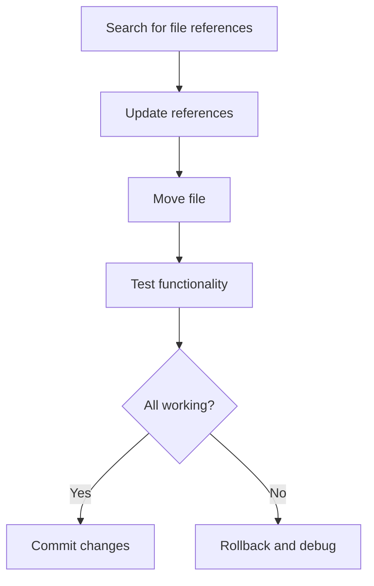

# File Organization Cleanup - Design

## Architecture Overview
This cleanup initiative addresses structural issues in the project's file organization through a phased approach that prioritizes critical build issues, then systematic file relocation, and finally cleanup of unnecessary artifacts.

## Design Principles

### Principle 1: Convention Over Configuration
- Files should be in expected locations based on industry standards
- Build artifacts should follow TypeScript/Node.js conventions
- Test files should be consolidated in test directories

### Principle 2: Atomic Operations
- Each phase can be completed and tested independently
- Rollback capability at each phase boundary
- No breaking changes within a phase

### Principle 3: Zero Disruption
- All functionality preserved throughout reorganization
- References updated before files are moved
- Comprehensive testing after each critical change

## Component Design

### Phase 1: Build Configuration Fix
```
Current State:     Desired State:
lib/               lib/
├── cli/           ├── cli/
└── lib/           ├── archival-engine.js
    ├── archival/  ├── configuration-manager.js
    └── ...        └── ...
```

**Root Cause**: TypeScript `outDir` configuration creating nested structure
**Solution**: Review and fix `tsconfig.json` compilation settings

### Phase 2: File Relocation Matrix
```
Source Location              Target Location           Rationale
─────────────────────────────────────────────────────────────────
kiro-hook-executor.js    →   .kiro/                   Kiro infrastructure
VALUE_PROPOSITION.md     →   docs/                    Project documentation  
test-integration.js      →   __tests__/               Test consolidation
```

### Phase 3: Cleanup Operations
```
Cleanup Target               Action                   Reason
─────────────────────────────────────────────────────────────────
current-js-files.txt         DELETE                   Temporary artifact
test-empty-dir/              DELETE                   Empty directory
test-npx/                    DELETE                   Empty directory
coverage/tmp/*.json          DELETE                   Coverage artifacts
```

## Implementation Strategy

### Strategy 1: Build First Approach
1. **Investigate Build Issue**: Analyze why `lib/lib/` structure exists
2. **Fix Configuration**: Update tsconfig.json or build scripts
3. **Rebuild and Verify**: Ensure proper compilation output
4. **Clean Old Structure**: Remove incorrect nested directories

### Strategy 2: Reference-First Movement


### Strategy 3: Validation Framework
- **Pre-move validation**: Search for all references to file
- **Post-move validation**: Verify all functionality works
- **Integration testing**: Run full test suite after each phase

## Detailed Component Specifications

### Build Configuration Component
**Responsibility**: Fix TypeScript compilation output structure
**Interface**: 
- Input: Current tsconfig.json settings
- Output: Corrected build configuration
- Side Effects: Rebuilt lib/ directory structure

**Implementation**:
```typescript
// Expected tsconfig.json modification
{
  "compilerOptions": {
    "outDir": "./lib",        // NOT "./lib/lib"
    "rootDir": "./src"
  }
}
```

### File Movement Component
**Responsibility**: Safely relocate files with reference updates
**Interface**:
- Input: Source path, target path, file content
- Output: Updated file in new location
- Side Effects: Updated references in other files

**Algorithm**:
1. Create target directory if needed
2. Search codebase for references to source path
3. Update all found references to target path
4. Move file using git mv (preserves history)
5. Verify no broken references remain

### Cleanup Component
**Responsibility**: Remove unnecessary files and directories
**Interface**:
- Input: List of paths to remove
- Output: Cleaned directory structure
- Side Effects: Deleted files and directories

**Safety Checks**:
- Verify target is not referenced in any code
- Confirm target is actually unnecessary (not just hidden)
- Use safe deletion (move to temp first, then delete)

## Data Flow

### Build Fix Flow
```
tsconfig.json → TypeScript Compiler → lib/ (flat structure)
```

### File Movement Flow
```
Search References → Update References → Git Move → Verify → Commit
```

### Cleanup Flow
```
Identify Targets → Safety Check → Remove → Verify Cleanup → Commit
```

## Error Handling

### Build Errors
- **Detection**: Compilation failures or incorrect output structure
- **Recovery**: Revert tsconfig.json changes and investigate further
- **Fallback**: Manual restructuring of lib/ directory if needed

### Reference Errors
- **Detection**: Broken imports or missing files after move
- **Recovery**: Restore file to original location and update references
- **Prevention**: Comprehensive reference search before moving

### Cleanup Errors
- **Detection**: Functionality broken after file deletion
- **Recovery**: Restore from git history
- **Prevention**: Conservative approach - only delete obviously unnecessary files

## Testing Strategy

### Unit Testing
- All existing unit tests must continue to pass
- No modifications to test logic required

### Integration Testing
- File movement must not break integration tests
- Hook system must continue to function after kiro file moves
- Build process must work correctly after configuration changes

### Manual Testing
- NPX execution must work correctly
- All CLI functionality must remain intact
- Documentation links must resolve correctly

## Performance Considerations

### Build Performance
- Fixing lib/lib/ structure may improve build times
- Reduced file system nesting should improve access times

### Development Experience
- Cleaner root directory improves navigation
- Logical file organization reduces confusion
- Consistent structure aids new developer onboarding

## Security Considerations

### File Movement Security
- Use git mv to preserve file history and blame information
- Ensure no sensitive information is exposed during movement
- Verify file permissions are preserved

### Reference Update Security
- Automated reference updates must not modify unintended files
- Search patterns must be precise to avoid false positives
- All changes must be reviewable in git diff

## Monitoring and Validation

### Success Metrics
- Zero test failures after reorganization
- All file references resolve correctly
- Build output structure matches expectations
- Reduced root directory file count

### Validation Checkpoints
1. Post-build fix: Verify lib/ structure is correct
2. Post-file moves: Verify all functionality works
3. Post-cleanup: Verify no unnecessary files remain
4. Final validation: Complete test suite passes